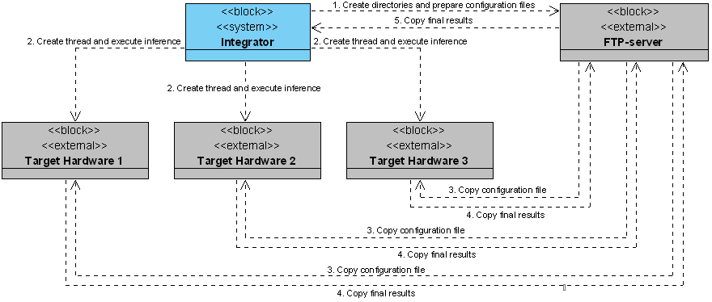

# Архитектура системы

Система анализа производительности вывода глубоких нейросетевых моделей
состоит из нескольких основных компонент.

1. *Target Hardware*. Целевой компьютер, на котором выполняется вывод
   моделей. Предполагается, что на узел предварительно установлено
   необходимое программное обеспечение и подготовлен набор моделей
   для анализа производительности вывода. Бэнчмаркинг каждой модели
   выполняется последовательно посредством запуска отдельного процесса.
1. *FTP server*. FTP-сервер используется для хранения конфигурации проводимых
   тестов и результатов производительности.
1. *Integrator*. Компонент предназначен для объединения показателей
   производительности с целью последующего предоставления общего доступа
   через сеть Интернет.

