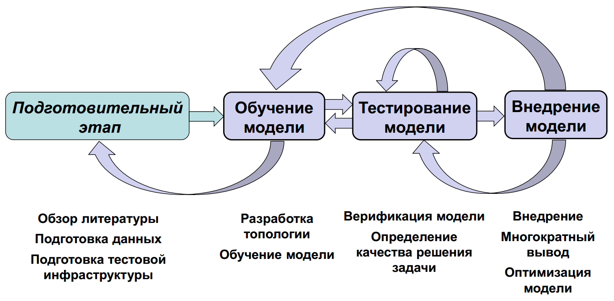
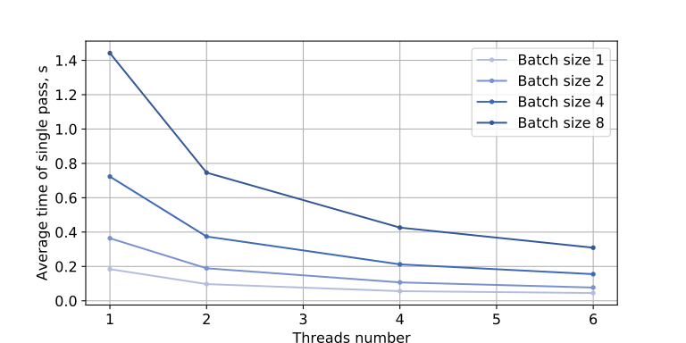
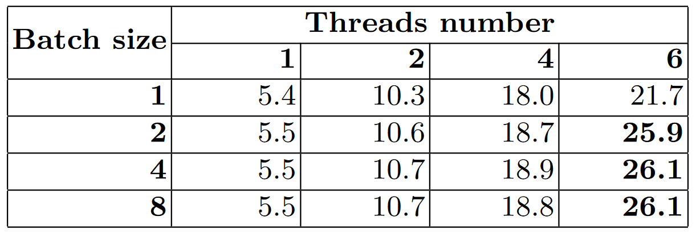
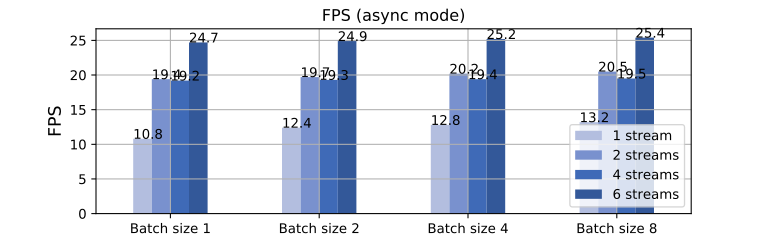

# Deep Learning Inference Benchmark - измеряем скорость работы моделей глубокого обучения

 

Перед разработчиками встает задача определения производительности железа в задаче исполнения глубоких моделей. 
Например, хочется решить проблему анализа пола-возраста покупателей, которые заходят в магазин, чтобы в зависимости от этого менять оформление магазина или наполнение товаром. 
Вы уже знаете какие модели хотите использовать в вашем ПО, но до конца не понятно как выбрать железо. 
Можно выбрать самый топ и переплачивать как за простаивающие мощности, так и за электроэнергию.
Можно взять самый дешевый i3 и потом вдруг окажется, что он может вывезти каскад из нескольких глубоких моделей на 8 камерах. 
А может быть камера всего одна, и для решения задачи достаточно Raspberry Pi с Movidius Neural Compute Stick? 
Поэтому хочется иметь инструмент для оценки скорости работы вашего инференса на разном железе, причем еще до начала обучения. 

В целом можно выделить три направления работы с глубокими моделями:
1. Обучение. На обучение глубоких моделей уходит требуется много, очень много, а иногда и очень-очень много вычислительной мощности. Начиная с первой ласточки [AlexNet](https://papers.nips.cc/paper/4824-imagenet-classification-with-deep-convolutional-neural-networks.pdf) (61 миллион параметров), и заканчивая [GPT-3](https://news.developer.nvidia.com/openai-presents-gpt-3-a-175-billion-parameters-language-model/) с 175 миллиардами параметров.
2. Transfer Learning. Берем существующую модель (как правило решающую задачу классификации), и используем ее в качестве основы для собственной модели. Количество ресурсов для дообучения или переобучения можно значительно уменьшить по сравнению с обучением с нуля.
3. Использование моделей глубокого обучения в работе (Inference). Для использования глубоких моделей в прикладных задачах требуется минимизировать использование ресурсов. Решается это различными способами: использование оптимизированных библиотек, которые максимально плотно заполняют конвейер процессора вычислениями; конвертация параметров модели из fp32 в fp16, int8 или даже int1; использование специализированных ускорителей (GPU, TPU, FPGA, нейронные сопроцессоры). 

Общую схему решения задач с использованием глубокого обучения можно представить следующим образом:

 

Как правило, требования по скорости заложены еще на этапе постановки задачи, и хочется еще до начала обучения или дообучения узнать "уложится" или нет предполагаемая модель в доступные для инференса ресурсы. И для решения этой задачи был создан DLI benchmark.

## DLI benchmark

В рамках лаборатории ITLab студентами ННГУ им. Н.И.Лобачевского был разработан открытый фреймворк DLI (https://github.com/itlab-vision/dl-benchmark), который позволяет запустить измерение производительности большого количества разных моделей на доступном железе.

Основные требования, которые были заложены на этапе разработки:

1. Измерять время работы того, как модель будет работать в реальном Python приложении. 
    Мы включили в подсчет времени собственно исполнение модели и копирование обрабатываемых данных из python в библиотеку инференса (это может показать влияние на маленьких моделях).
2. Обладать модульной архитектурой, чтобы иметь возможность включать в тестирование новые фреймворки, новые модели, новое железо.  

### Архитектура фреймворка

1. Target Hardware - устройства для выполнения замеров. Предполагается, что на этом компьютере установлено необходимое программное обеспечение (сейчас это делается в Docker) и подготовлен набор моделей для тестирования.
2. FTP-сервер - хранит конфигурации тестов для каждого тестируемого устройства и результаты измерений.
3. Integrator - это компонент, предназначенный для сбора результатов производительности. 

Алгоритм работы DLI-benchmark:

1. Интегратор создает структуру каталогов на FTP-сервере и генерирует файлы конфигурации тестов для инференса на доступных машинах
2. Интегратор запускает анализ производительности на каждом устройстве. Анализ производительности на конкретном устройстве включает получение файла конфигурации тестов и последовательное выполнение тестов для каждой модели в отдельном процессе. Измерения производительности собираются во время тестов.
3. По завершении тестов результаты производительности копируются из FTP-сервер.
4. После того, как бенчмарк завершит все тесты на всём оборудовании, полученные результаты сохраняются в виде csv-таблицы, которая автоматически конвертируется в html-страницу для сайта проекта.

## Типы экспериментов

В целом разработчикам привычен синхронный вариант работы программы, когда сначала читается картинка из файла, масштабируется под размер входа сети, вызывается функция `run` или `forward`, и цикл начинается сначала.

При обработке картинок по одной вычислительное устройство очень часто недогружено. Можно подать два изображения одной пачкой (batch=2), тогда они обработаются быстрее чем два изображения по отдельности. При увеличении размера пачки производительность сначала начнет расти, а потом падать, и определить лучший размер пачки весьма полезно. 

В современных фреймворках поддерживается асинхронный режим работы, когда не нужно дожидаться конца обработки предыдущего изображения, можно новую картинку начать обрабатывать сразу после поступления. При использовании асинхронного API в OpenVINO можно создавать реквесты по 1 картинке независимо и при этом получать по прежнему высокую производительность и при этом низкие задержки. Возможность получать высокую производительность, сохраняя при этом низкие задержки, открывает новые возможности для инференса глубоких моделей на многосокетных высокопроизводительных системах.

### Метрики производительности

- Латентность или задержка (Latency) - медианное время обработки одной пачки картинок.
- Среднее время одного прохода (Average time of a single pass) - отношение общего времени обработки всех пачек к числу итераций цикла тестирования.
- Среднее количество кадров, обрабатываемых за секунду (Frames per Second, FPS) - отношение размера пачки изображений к латентности.

В том случае, когда мы можем подавать несколько картинок независимо друг от друга (асинхронный запуск на обработку), мы используем другие метрики производительности.

- Среднее время одного прохода (Average time of a single pass) - отношение времени обработки всех пачек к количеству итераций цикла тестирования. Представляет собой время выполнения одновременно созданных пачек на устройстве.
- Среднее количество кадров, обрабатываемых за секунду (Frames per Second, FPS) - отношение произведения размера пачки изображений и числа итераций ко времени обработки всех пачек.

## Анализ результатов

В ходе экспериментов мы попробовали бенчмарк на различном оборудовании: CPU i7-7700K, i5-8600K, i3-7100, i7-8700, i3-8100, GPU Intel HD Graphics 630, Intel Neural Compute Stick 2.

Пока опубликовали результаты только для фреймворка OpenVINO. Докеры бенчмарка с Caffe, TensofFlow и PyTorch в разработке.

Для демонстрации примеров работы возьмем модель ResNet-152 - это очень объемная модель, которая решает задачу классификации ImageNet.  

На графике ниже представлена время обработки одной пачки картинок в различных режимах. На данном графике по оси X отложено количество потоков процессора, которые были использованы для обработки изображений, а по оси Y - среднее время обработки (или задержка, latency) одной пачки изображений. На этом графике мы видим, что при удвоении использованных потоков скорость обработки увеличивается примерно в два раза - это означает отличную параллеллизацию в обработке изображений. Что важно, параллелизация показывает хорошие результаты и для большой пачки картинок, и для одиночной картинки.  

 

Чтобы посчитать FPS (сколько в среднем картинок в секунду обработает процессор в каждом режиме работы) нужно количество картинок в пачке разделить на время обработки одной пачки. Эти данные мы приведем в таблице ниже.

 

Взглянув на эти цифры, мы видим, что если мы будем использовать все 6 ядер процессора, что при обработке картинок пачками по 8 штук производительность возрастает на 20% из-за более плотной упаковки вычислений. Но в прикладном ПО не слишком хочется писать дополнительные функции, чтобы собирать картинки в пачки, да и задержки тогда возрастают...  

В этом случае нам на помощь приходит асинхронный запуск нескольких картинок на обработку! OpenVINO поддерживает возможность не собирать из картинок большую пачку, а подавать картинки независимо друг от друга не дожидаясь завершения обработки предыдущей. В данном режиме вы задаете в программе количество "стримов" (это не поток процессора; это сущность, которая захватывает один или несколько потоков процессора и обрабатывает в себе картинку), и можете независимо запускать на обработку картинки по мере поступления.

 

С использованием OpenVINO в асинхронном режиме с размером пачки в 1 картинку мы почти достигаем производительности, полученной в синхронном режиме с размером пачки 8, при этом почти не меняя код запуска моделей.

Результаты производительности 63 моделей на CPU, Intel GPU и Intel Neural Compute Stick 2 собраны в HTML-таблиц, посмотреть их можно здесь:
http://hpc-education.unn.ru/en/dli
Пока мы измеряли только производительность моделей, сконвертированных в OpenVINO. Уже пишется код для тестирования моделей Caffe, и в разработке другие библиотеки глубокого обучения. 
