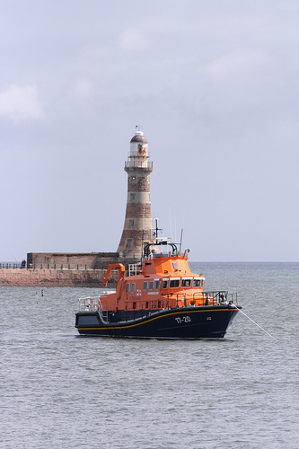

# Конвертер моделей из формата ONNX в MXNet

## Установка пакета

```bash
conda create --name onnx2mxnet-3.9.13 python=3.9.13 --yes
conda activate onnx2mxnet-3.9.13
pip install --upgrade pip setuptools wheel
pip install -r ./requirements.txt
conda deactivate
```

## Запуск скрипта конвертации

**Название скрипта:**

```bash
convert_onnx_to_mxnet.py
```

**Обязательные аргументы:**

- `-m / --model` – путь до описания обученной модели, которое хранится в файле расширением `.onnx`.

**Опциональные аргументы:**

- `-mn / --model_name` – название модели для сохранения (по умолчанию `model`).
- `-p / --path_save_model` – путь для сохранения файлов модели. В процессе сохранения внутри указанной директории
  создается вложенная директория с названием модели `<model_name>`. Формируется два файла:
    - `<model_name>-0000.params` - бинарный файл с обученными параметрами модели
    - `<model_name>-symbol.json` - архитектура модели

  По умолчанию модель сохраняется в текущей директории.

**Пример запуска:**

```bash
python3 convert_onnx_to_mxnet.py \
  --model ./vgg16.onnx \
  --model_name vgg16 \
  --path_save_model ./vgg16
```

## Валидация моделей

Все модели загружены из [ONNX models][onnx_models].

### Тестовое изображение 1


|Model|ONNX|MXNet|
|-|-|-|
|AlexNet|0.9329359 Granny Smith <br/>0.0119514 piggy bank, penny bank <br/>0.0090174 bell pepper <br/>0.0076609 candle, taper, wax light <br/>0.0072427 saltshaker, salt shaker|0.0025379 Granny Smith <br/>0.0010104 piggy bank, penny bank <br/>0.0010074 bell pepper <br/>0.0010061 candle, taper, wax light <br/>0.0010057 saltshaker, salt shaker|
|Inception v1|0.9996701 Granny Smith <br/>0.0001812 bell pepper <br/>0.0001091 candle, taper, wax light <br/>0.0000101 tennis ball <br/>0.0000047 cucumber, cuke|0.0027022 Granny Smith <br/>0.0010000 bell pepper <br/>0.0009994 candle, taper, wax light <br/>0.0009985 tennis ball <br/>0.0009984 cucumber, cuke|
|Inception v2|0.8113499 leafhopper <br/>0.0321103 police van, police wagon, paddy wagon, patrol wagon, wagon, black Maria <br/>0.0176959 ringlet, ringlet butterfly <br/>0.0068110 forklift <br/>0.0061042 dragonfly, darning needle, devil's darning needle, sewing needle, snake feeder, snake doctor, mosquito hawk, skeeter hawk|0.0021662 leafhopper <br/>0.0010387 police van, police wagon, paddy wagon, patrol wagon, wagon, black Maria <br/>0.0010119 ringlet, ringlet butterfly <br/>0.0010064 dragonfly, darning needle, devil's darning needle, sewing needle, snake feeder, snake doctor, mosquito hawk, skeeter hawk <br/>0.0010056 forklift|
|MobileNet v2|15.1163692 Granny Smith<br/>13.3467827 piggy bank, penny bank<br/>9.6588764 vase<br/>9.2533312 pencil sharpener<br/>9.1322794 teapot|0.8293539 Granny Smith<br/>0.1413252 piggy bank, penny bank<br/>0.0035365 vase<br/>0.0023575 pencil sharpener<br/>0.0020888 teapot|
|SqueezeNet 1.1|22.3268242 Granny Smith<br/>22.2902660 piggy bank, penny bank<br/>20.8840656 ocarina, sweet potato<br/>19.8772392 teapot<br/>19.7640572 necklace|0.3753771 Granny Smith<br/>0.3619032 piggy bank, penny bank<br/>0.0886926 ocarina, sweet potato<br/>0.0324061 teapot<br/>0.0289384 necklace|
|VGG 16|14.2978382 Granny Smith<br/>10.1649094 piggy bank, penny bank<br/>10.0847054 dumbbell<br/>9.7713060 maraca<br/>9.7364922 tennis ball|0.9017522 Granny Smith<br/>0.0144603 piggy bank, penny bank<br/>0.0133458 dumbbell<br/>0.0097552 maraca<br/>0.0094215 tennis ball|
|VGG 19|9.5931635 Granny Smith<br/>7.2290239 piggy bank, penny bank<br/>7.1850996 saltshaker, salt shaker<br/>6.7277513 dumbbell<br/>6.7231359 pencil sharpener|0.4857184 Granny Smith<br/>0.0456722 piggy bank, penny bank<br/>0.0437094 saltshaker, salt shaker<br/>0.0276663 dumbbell<br/>0.0275389 pencil sharpener|

### Тестовое изображение 2


|Model|ONNX|MXNet|
|-|-|-|
|AlexNet|0.9254803 junco, snowbird <br/>0.0660609 chickadee <br/>0.0045172 brambling, Fringilla montifringilla <br/>0.0010812 water ouzel, dipper <br/>0.0005364 bulbul|0.0025191 junco, snowbird <br/>0.0010666 chickadee <br/>0.0010029 brambling, Fringilla montifringilla <br/>0.0009995 water ouzel, dipper <br/>0.0009989 bulbul|
|Inception v1|0.9999988 junco, snowbird <br/>0.0000010 chickadee <br/>0.0000001 brambling, Fringilla montifringilla <br/>0.0000001 house finch, linnet, Carpodacus mexicanus <br/>0.0000000 water ouzel, dipper|0.0027135 junco, snowbird <br/>0.0009983 chickadee <br/>0.0009983 brambling, Fringilla montifringilla <br/>0.0009983 house finch, linnet, Carpodacus mexicanus <br/>0.0009983 water ouzel, dipper|
|Inception v2|0.9939745 giant panda, panda, panda bear, coon bear, Ailuropoda melanoleuca <br/>0.0015418 gar, garfish, garpike, billfish, Lepisosteus osseus <br/>0.0008273 barracouta, snoek <br/>0.0005433 sturgeon <br/>0.0004746 basketball|0.0026997 giant panda, panda, panda bear, coon bear, Ailuropoda melanoleuca <br/>0.0009996 gar, garfish, garpike, billfish, Lepisosteus osseus <br/>0.0009991 barracouta, snoek <br/>0.0009989 sturgeon <br/>0.0009986 apron|
|MobileNet v2|19.9814053 junco, snowbird<br/>15.5709257 brambling, Fringilla montifringilla<br/>14.9534264 chickadee<br/>14.6156979 house finch, linnet, Carpodacus mexicanus<br/>12.8855562 goldfinch, Carduelis carduelis|0.9755908 junco, snowbird<br/>0.0118528 brambling, Fringilla montifringilla<br/>0.0063920 chickadee<br/>0.0045600 house finch, linnet, Carpodacus mexicanus<br/>0.0008083 goldfinch, Carduelis carduelis|
|SqueezeNet 1.1|37.3378258 junco, snowbird<br/>35.1360474 brambling, Fringilla montifringilla<br/>33.9645462 chickadee<br/>32.5760193 goldfinch, Carduelis carduelis<br/>31.1268520 house finch, linnet, Carpodacus mexicanus|0.8637294 junco, snowbird<br/>0.0955339 brambling, Fringilla montifringilla<br/>0.0296059 chickadee<br/>0.0073850 goldfinch, Carduelis carduelis<br/>0.0017337 house finch, linnet, Carpodacus mexicanus|
|VGG 16|30.0659161 junco, snowbird<br/>24.4124374 chickadee<br/>24.2297859 brambling, Fringilla montifringilla<br/>20.3612823 goldfinch, Carduelis carduelis<br/>19.7643280 water ouzel, dipper|0.9934963 junco, snowbird<br/>0.0034825 chickadee<br/>0.0029011 brambling, Fringilla montifringilla<br/>0.0000606 goldfinch, Carduelis carduelis<br/>0.0000334 water ouzel, dipper|
|VGG 19|27.8706684 junco, snowbird<br/>22.1559544 chickadee<br/>20.9320812 water ouzel, dipper<br/>20.1566486 brambling, Fringilla montifringilla<br/>16.6844444 house finch, linnet, Carpodacus mexicanus|0.9952694 junco, snowbird<br/>0.0032815 chickadee<br/>0.0009651 water ouzel, dipper<br/>0.0004444 brambling, Fringilla montifringilla<br/>0.0000138 house finch, linnet, Carpodacus mexicanus|

### Тестовое изображение 3



|Model|ONNX|MXNet|
|-|-|-|
|AlexNet|0.8644474 lifeboat <br/>0.0432644 container ship, containership, container vessel <br/>0.0229281 beacon, lighthouse, beacon light, pharos <br/>0.0205268 liner, ocean liner <br/>0.0169515 breakwater, groin, groyne, mole, bulwark, seawall, jetty|0.0023701 lifeboat <br/>0.0010426 container ship, containership, container vessel <br/>0.0010216 beacon, lighthouse, beacon light, pharos <br/>0.0010192 liner, ocean liner <br/>0.0010156 breakwater, groin, groyne, mole, bulwark, seawall, jetty|
|Inception v1|0.5498168 lifeboat <br/>0.2570190 drilling platform, offshore rig <br/>0.0660438 container ship, containership, container vessel <br/>0.0549428 liner, ocean liner <br/>0.0401244 beacon, lighthouse, beacon light, pharos|0.0014646 lifeboat <br/>0.0012426 drilling platform, offshore rig <br/>0.0011012 container ship, containership, container vessel <br/>0.0010823 liner, ocean liner <br/>0.0010631 beacon, lighthouse, beacon light, pharos|
|Inception v2|0.9051369 miniature pinscher <br/>0.0136369 boxer <br/>0.0107890 submarine, pigboat, sub, U-boat <br/>0.0078098 bull mastiff <br/>0.0051228 French bulldog|0.0025058 miniature pinscher <br/>0.0010166 submarine, pigboat, sub, U-boat <br/>0.0010087 boxer <br/>0.0010049 bull mastiff <br/>0.0010023 Tibetan mastiff|
|MobileNet v2|10.8760290 breakwater, groin, groyne, mole, bulwark, seawall, jetty<br/>10.8641129 liner, ocean liner<br/>10.3814640 beacon, lighthouse, beacon light, pharos<br/>9.2762899 submarine, pigboat, sub, U-boat<br/>9.1381931 pop bottle, soda bottle|0.2696525 breakwater, groin, groyne, mole, bulwark, seawall, jetty<br/>0.2664548 liner, ocean liner<br/>0.1644420 beacon, lighthouse, beacon light, pharos<br/>0.0544546 submarine, pigboat, sub, U-boat<br/>0.0474306 pop bottle, soda bottle|
|SqueezeNet 1.1|22.0908108 fireboat<br/>21.9391842 liner, ocean liner<br/>21.3744106 drilling platform, offshore rig<br/>20.5195694 container ship, containership, container vessel<br/>19.9482613 submarine, pigboat, sub, U-boat|0.3252095 fireboat<br/>0.2794554 liner, ocean liner<br/>0.1588664 drilling platform, offshore rig<br/>0.0675739 container ship, containership, container vessel<br/>0.0381650 submarine, pigboat, sub, U-boat|
|VGG 16|12.9318199 container ship, containership, container vessel<br/>11.5314579 liner, ocean liner<br/>11.3399763 fireboat<br/>10.8501625 breakwater, groin, groyne, mole, bulwark, seawall, jetty<br/>10.4625912 lifeboat|0.5196506 container ship, containership, container vessel<br/>0.1280980 liner, ocean liner<br/>0.1057751 fireboat<br/>0.0648128 breakwater, groin, groyne, mole, bulwark, seawall, jetty<br/>0.0439886 lifeboat|
|VGG 19|12.8443079 container ship, containership, container vessel<br/>12.2016411 drilling platform, offshore rig<br/>11.3992987 breakwater, groin, groyne, mole, bulwark, seawall, jetty<br/>11.3968639 liner, ocean liner<br/>10.8498840 fireboat|0.4066454 container ship, containership, container vessel<br/>0.2138496 drilling platform, offshore rig<br/>0.0958640 breakwater, groin, groyne, mole, bulwark, seawall, jetty<br/>0.0956311 liner, ocean liner<br/>0.0553411 fireboat|

### Ошибки

|Model|Script|Error|
|-|-|-|
|SqueezeNet 1.0|inference_mxnet_sync_mode.py|Segmentation fault: 11<br/>libc++abi: terminating|

<!-- LINKS -->
[onnx_models]: https://github.com/onnx/models
