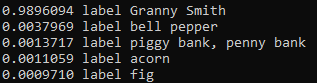
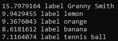
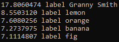
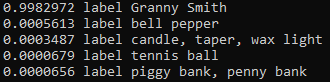
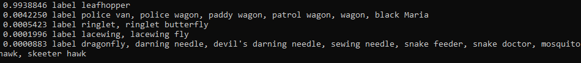
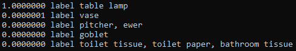
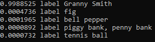
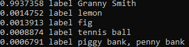
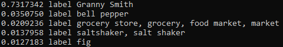

# Результаты проверки корректности вывода с использованием разных режимов

## Результаты классификации

### Тестовое изображение 1

Источник: набор данных [ImageNet][imagenet]

Разрешение: 709 x 510


   Название модели   |            C++ (синхронный режим)              |            C++ (асинхронный режим)              |             Python (синхронный режим)             |             Python (асинхронный режим)             |
---------------------|------------------------------------------------|-------------------------------------------------|---------------------------------------------------|----------------------------------------------------|
alexnet              |            |            |            |            |
densenet-121         |       |       |       |       |
densenet-161         |       |       |       |       |
densenet-201         |       |       |       |       |
googlenet-v1         |       |       |       |   |
googlenet-v2         |       |       |       |   |
googlenet-v4         |       |       |       |   |
inception-resnet-v2  |||||
squeezenet-1.0       |     |     |     |     |
squeezenet-1.1       |     |     |     |     |
vgg-16               |             |             |             |             |
vgg-19               |             |             |             |             |
 
### Тестовое изображение 2

Источник: набор данных [ImageNet][imagenet]

Разрешение: 500 x 500


   Название модели   |   C++ (синхронный режим)  |  C++ (асинхронный режим)  |   Python (синхронный режим)  |  Python (асинхронный режим)|
---------------------|---------------------------|---------------------------|------------------------------|----------------------------|
alexnet              |                           |                           |                              |                            |
densenet-121         |                           |                           |                              |                            |
densenet-161         |                           |                           |                              |                            |
densenet-169         |                           |                           |                              |                            |
densenet-201         |                           |                           |                              |                            |
googlenet-v1         |                           |                           |                              |                            |
googlenet-v2         |                           |                           |                              |                            |
googlenet-v4         |                           |                           |                              |                            |
inception-resnet v2  |                           |                           |                              |                            |
squeezenet-1.0       |                           |                           |                              |                            |
squeezenet-1.1       |                           |                           |                              |                            |
vgg-16               |                           |                           |                              |                            |
vgg-19               |                           |                           |                              |                            |

### Тестовое изображение 3

Источник: набор данных [ImageNet][imagenet]

Разрешение: 333 x 500


   Название модели   |   C++ (синхронный режим)  |  C++ (асинхронный режим)  |   Python (синхронный режим)  |  Python (асинхронный режим)|
---------------------|---------------------------|---------------------------|------------------------------|----------------------------|
alexnet              |                           |                           |                              |                            |
densenet-121         |                           |                           |                              |                            |
densenet-161         |                           |                           |                              |                            |
densenet-169         |                           |                           |                              |                            |
densenet-201         |                           |                           |                              |                            |
googlenet-v1         |                           |                           |                              |                            |
googlenet-v2         |                           |                           |                              |                            |
googlenet-v4         |                           |                           |                              |                            |
inception-resnet v2  |                           |                           |                              |                            |
squeezenet-1.0       |                           |                           |                              |                            |
squeezenet-1.1       |                           |                           |                              |                            |
vgg-16               |                           |                           |                              |                            |
vgg-19               |                           |                           |                              |                            |

<!-- LINKS -->
[imagenet]: http://www.image-net.org